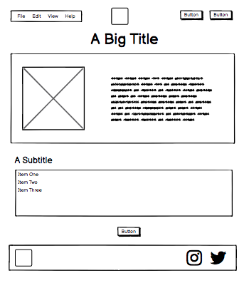
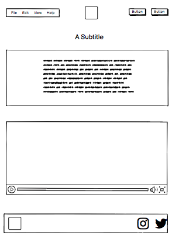
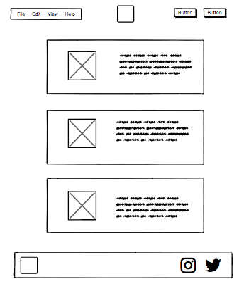
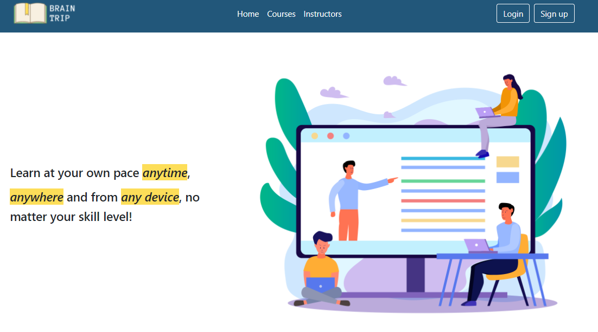
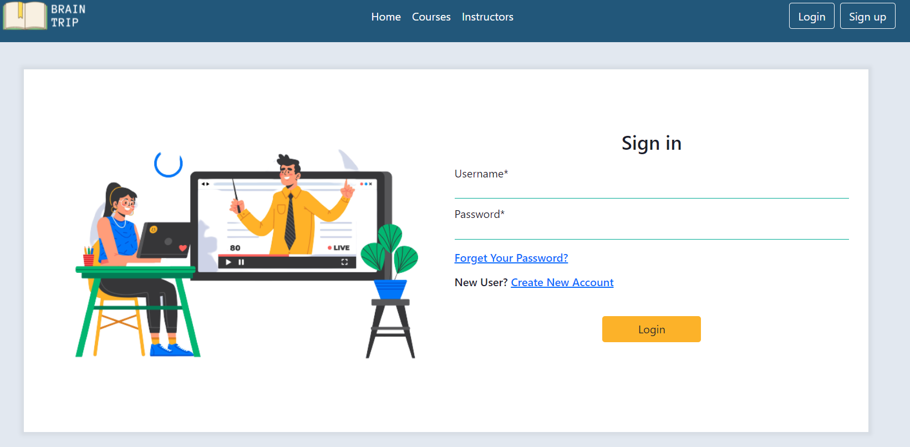
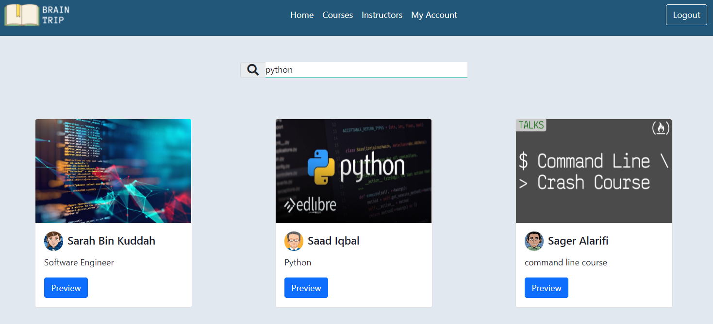

## What is the story behind this Online Courses Website?
A web app for online courses. Users can sign up as teachers or students. It allows teachers to add courses with video or text lessons for each course. Students are able to browse through courses and register to as many as they like. They will be able to read or watch lessons.

# User Stories:
- As a user, I want to sign up, log in, and logout of the site
- As a user I want to have a profile page to edit my information
- As a user I want to see all courses and search for specific one
- As a user I want to register to watch all lessons
- As a user I want to change and reset password
- As an instructor I want to have a feature to add, edit, and delete courses and lessons

## List of technologies used in this project:
- Django
- Postgres
- Bootstrap
- CSS
- HTML
- JavaScript
- Git
- VS Code
- Balsamiq
- Lucid chart

# A couple paragraphs about the general approach you took
 Started with writing user stories,then move to design wireframe and ERD models for database.
 We worked on the front end first, then move to back end.

## Wireframes:

# An embedded screenshot of the app:

## Planning/Development process and problem-solving strategy:
- Started with writing user stories
- Worked on the wireframe and ERD models for database
- Created database by using Postgres
- Started working on the front-end
- Then moved to the back-end

## Installation Instructions:
run the commands in this sequence
- git clone < git url> #clone repo
- cd <cloned folder name> # change directory
- code django_courses/settings.py # Now update the ‘USER’ and ‘PASSWORD’ values in DATABASES.
- pipenv shell # start workspace
- pipenv install #install all dependencies
- psql # To Connect to the database, you can use `psql -U postgres`
`postgres=` CREATE DATABASE onlinecourses;# To create onlinecourses
`postgres=` \q # To quit the database
- python manage.py createsuperuser # Creating an admin user. IF it is not work try `$ winpty python manage.py createsuperuser`
- python manage.py makemigrations
- python manage.py migrate
- python manage.py runserver # start server

## Future Improvements :
- We will add quiz section for each course so that students are able to watch a lesson and take a quiz at the end to see if pass or not.

## Some useful Resources:
- https://lucid.app/documents#/dashboard?folder_id=home
- https://balsamiq.com/
- https://www.freepik.com/
- https://pngtree.com/